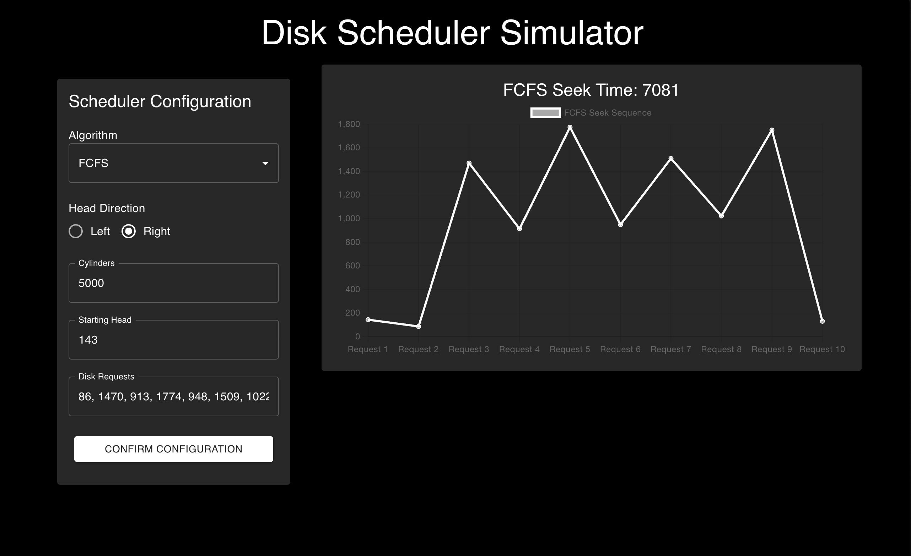
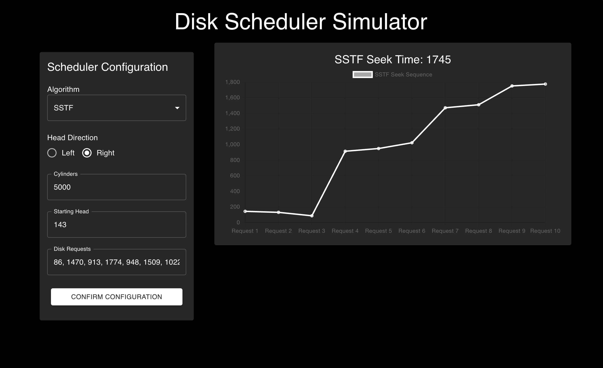
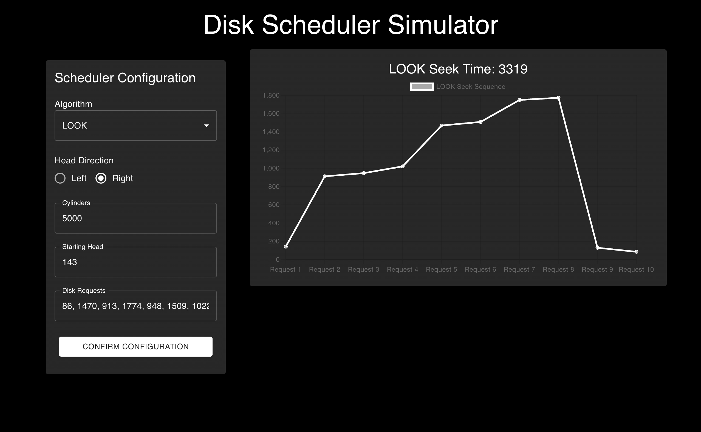
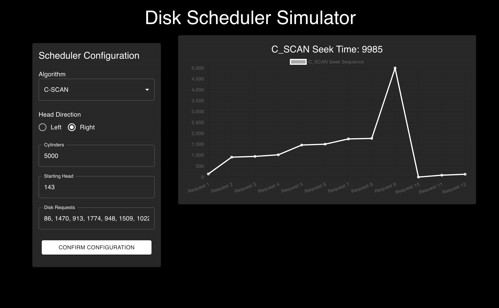
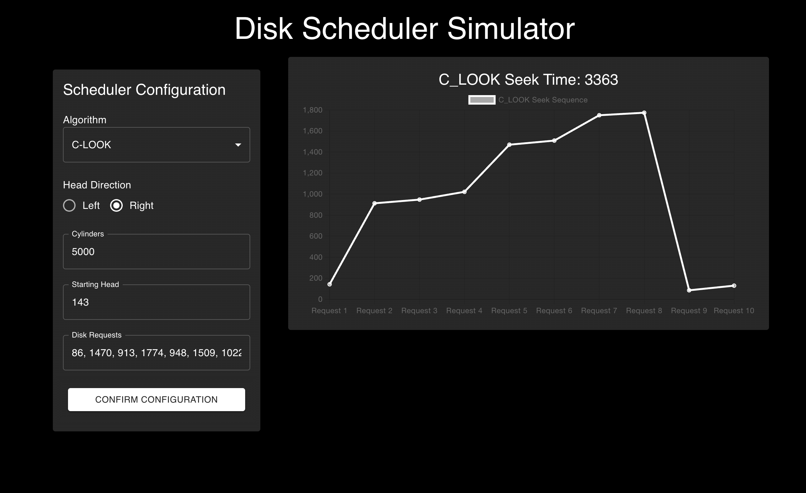

# Disk Scheduling Simulator

This project originated as an Operating Systems assignment, and I decided to turn it into a simulator app. Please excuse the AI-generated frontend. :D

## Table of Contents

- [Overview](#overview)
- [Disk Scheduling Algorithms](#disk-scheduling-algorithms)
- [Requirements](#requirements)
- [Building the Shared Library](#building-the-shared-library)
- [Backend Setup](#backend-setup)
- [API Endpoints](#api-endpoints)
- [Screenshots](#screenshots)
## Overview

The Disk Scheduling Simulator provides implementations of various disk scheduling algorithms using C++. The project includes a shared C++ library that can be called from a Python-based backend API using FastAPI. The backend API allows users to input requests and retrieve the scheduling results, including the total distance and the sequence of requests visited.

## Disk Scheduling Algorithms

The following disk scheduling algorithms are implemented:

- FCFS (First-Come, First-Served)
- SSTF (Shortest Seek Time First)
- SCAN (Elevator Algorithm)
- LOOK
- C-SCAN (Circular SCAN)
- C-LOOK (Circular LOOK)

## Requirements

- C++ compiler (e.g., `g++`)
- Python 3.7+
- FastAPI
- `ctypes` library (Python standard library)

## Building the Shared Library

To build the shared C++ library (`libdisk_scheduling.so`), follow these steps:

1. Navigate to the project directory containing the `disk_scheduling.cpp` file.
2. Compile the C++ code into a shared library:

    ```sh
    g++ -shared -o libdisk_scheduling.so -fPIC disk_scheduling.cpp
    ```

This will generate the shared library `libdisk_scheduling.so` which can be used in the Python backend.

## Backend Setup

To set up the backend API using FastAPI, follow these steps:

1. Ensure you have Python 3.7+ installed.
2. Install the required Python packages:

    ```sh
    pip install fastapi uvicorn
    ```

3. Place the `disk_scheduling_wrapper.py` and `main.py` files in your project directory.
4. Make sure the `libdisk_scheduling.so` file is in the same directory as `disk_scheduling_wrapper.py`.

## API Endpoints

The following API endpoints are available:

- `POST /fcfs`: Computes the FCFS scheduling.
- `POST /sstf`: Computes the SSTF scheduling.
- `POST /scan`: Computes the SCAN scheduling.
- `POST /look`: Computes the LOOK scheduling.
- `POST /c_scan`: Computes the C-SCAN scheduling.
- `POST /c_look`: Computes the C-LOOK scheduling.

## Screenshots

Here are some screenshots of the Disk Scheduling Simulator in action:


### FCFS Algorithm Visualization


### SSTF Algorithm Visualization


### SCAN Algorithm Visualization


### LOOK Algorithm Visualization


### C-SCAN Algorithm Visualization


### C-LOOK Algorithm Visualization

